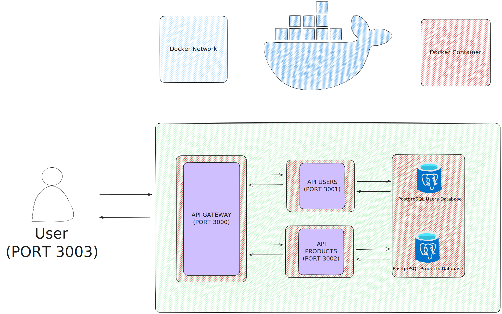

<h1>Microservicios con Docker - API Gateway</h1>

<h2>Proyecto para practicar la implementación de microservicios con una API Gateway que redirige las peticiones a dos microservicios (uno de autenticación y otro de productos y sus categorías), cada uno de ellos virtualizados con docker</h2>

<h2>Tecnologías utilizadas</h2>

  

<h2>Arquitectura del sistema</h2>

<h2>Pasos para ejecutar el proyecto</h2>

<h3>Clonar el repositorio</h3>

      git clone https://github.com/Carlos-Galindo-Personal-Projects/microservices-docker.git
<h3>Navegar a microservices-docker y configurar las variables de entorno
<pre><code>cd ./microservices-docker</code></pre>
  
<h3>Navegar a api-gateway-frontend, instalar las dependencias, crear un archivo .env y ejecutarlo</h3>

Ir al directorio <code>api-gateway-frontend/</code>:

<pre><code>cd ../api-gateway-frontend/</code></pre>

Instalar las dependencias:

<pre><code>npm i</code></pre>

Crear un archivo <code>.env</code>:

<pre><code>touch .env</code></pre>

Agregar las siguientes variables al archivo <code>.env</code>:

<pre><code>
NEXT_PUBLIC_API_URL=http://localhost:3000/
JWT_SECRET=SUPER_SECRET_KEY
</code></pre>

Iniciar el proyecto:

<pre><code>next dev --experimental-https</code></pre>

<h3> Ahora puedes hacer usar el frontend en https://localhost:3003 y desde el mismo realizar peticiones a http://localhost:3000 y esta redirige las peticiones a http://localhost:3001 y http://localhost:3002  </h3>
